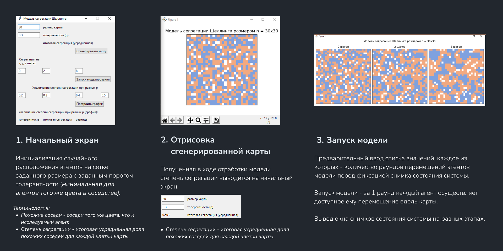
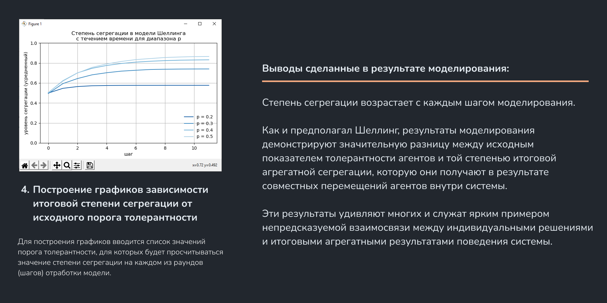

# Two-Dimensional-Schelling-Model

### Слайды с описанием модели Шеллинга и агентно-ориентированных моделей (АОМ) 
https://docs.google.com/presentation/d/1qI-a4kalsFTjoU8eTxzWArY6bUmkgldT/edit?usp=sharing&ouid=116380063982030312577&rtpof=true&sd=true

### Описание работы приложения 

